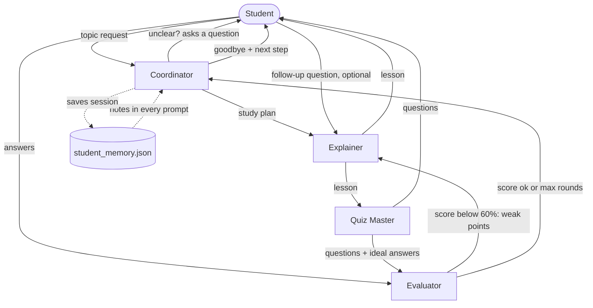

# Leo: Multi-Agent AI Tutor

Leo is a study assistant built from four CrewAI agents. You pick a topic, and the agents take turns: one plans, one teaches, one writes a quiz, one marks your answers. Each hands its work to the next. If you score low, the Evaluator sends the weak spots back to the Explainer to teach again (the bonus feedback loop). You can also pause after the lesson and ask the Explainer questions before the quiz starts, which covers the human-in-the-loop bonus.

## Two ways to use it

- **Streamlit** (`streamlit run app.py`): a web page with proper answer boxes, so long, multi-line or maths answers work fine. The sidebar shows the four agents and a running log of who finished what, plus every handoff.
- **Terminal** (`python main.py`): the same session in the CLI, with coloured agent labels and `>> X hands Y to Z` lines.

Both share the same agents, tasks, prompts and memory.

## The agents

| Agent | What it does | Output |
|---|---|---|
| Coordinator | Reads your request, asks a question if it's unclear, makes the study plan, and wraps up at the end | `Plan` (structured), goodbye message |
| Explainer | Teaches the topic, answers follow-up questions, and re-teaches weak spots | Plain-text lessons |
| Quiz Master | Writes short-answer questions from the lesson, each with an ideal answer | `Quiz` (structured) |
| Evaluator | Compares your answers with the ideal ones and gives feedback | `Evaluation` (structured) |

Every agent has its own role, goal and backstory in `prompts.py`, along with a task template for each step it handles.

## Architecture



## Orchestration pattern

The pattern is sequential. Each step runs as its own small CrewAI sequential crew, and what one agent produces becomes the input for the next:

1. Coordinator: request -> `Plan`
2. Explainer: plan -> lesson
3. Quiz Master: lesson -> `Quiz`
4. Evaluator: quiz + your answers -> `Evaluation`
5. If the score is below 60%: Evaluator -> Explainer (re-teach) -> Quiz Master (short second quiz). This runs at most 2 rounds.
6. Coordinator: wrap-up message

`main.py` (and `app.py` for the web version) decides which agent goes next, based on the structured outputs, for example `plan.clear` and the score.

## Memory

On the first run Leo creates `student_memory.json` (it isn't committed). It keeps each student's name, level and past sessions: topic, score and weak points. The last three sessions get written into the `{memory_notes}` part of the prompts, so Leo knows who it's talking to and what they struggled with before. It's plain JSON on purpose, so there's no paid embedding service to set up.

## When things go wrong

- **Unclear request:** the Coordinator asks a question and tries again, up to three times, then gives up politely.
- **An agent errors or stalls:** every agent is capped at 3 iterations and each step gets one retry. If it still fails, the Coordinator says so and moves on (the quiz gets skipped, say) instead of crashing.
- **Messy structured output:** before giving up, the code tries to pull the JSON out of the raw text.

## How to run

```bash
git clone <your-repo-url>
cd <your-repo-folder>
python -m venv .venv
source venv/bin/activate        # Windows: .venv\Scripts\activate
pip install -r requirements.txt
cp .env.example .env            # then paste your free API key into .env

streamlit run app.py            # web interface (recommended)
python main.py                  # or the terminal version
```

You need a free Groq key from console.groq.com. Put it in `.env` as `API_KEY`. The `MODEL_NAME` value looks odd on purpose: it's `openai/openai/gpt-oss-120b` because CrewAI strips the first `openai/`, and Groq's real model ID is `openai/gpt-oss-120b`. Any OpenAI-compatible provider works if you change `BASE_URL` and `MODEL_NAME`. `.env` is in `.gitignore`, so your key never gets committed.

## Files

```
app.py        Streamlit web interface
main.py       session loop and terminal version
agents.py     builds the four agents
tasks.py      builds the task for each step
prompts.py    prompt templates for every role and task
models.py     structured output classes (Plan, Quiz, Evaluation)
memory.py     reads and writes student_memory.json
```